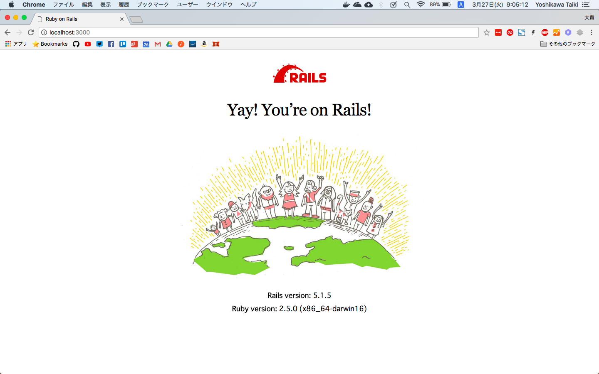

# Rails
Ruby version 2.5.0

Rails version 5.1.5

## Hello Rails
ここではRailsの基礎から学びます。

### Railsはその名の通りアプリ開発のレールを提供する
Railsというフレームワークを語る際に、よく言及されるのがRailsの設計哲学です。
- DRY(Don't Repeat Yourself) 同じ記述を繰り返さない
- CoC(Convention over Configuration) 設定よりも規約

### アプリの作成
`$ rails new railbook`

### HHTPサーバを起動
Railsは *Puma* というHTTPサーバを標準で提供しています。本番環境では、Nginx / Apache + Unicorn, Herokuなど、用途に応じてさまざまな選択肢がありますが、開発時点ではPumaで問題ないでしょう。
*カレントディレクトリをアプリの配下に移動* してrailsコマンドを実行してください。
```
$ cd railbook
$ rails server
=> Booting Puma
=> Rails 5.1.5 application starting in development
=> Run `rails server -h` for more startup options
Puma starting in single mode...
* Version 3.11.3 (ruby 2.5.0-p0), codename: Love Song
* Min threads: 5, max threads: 5
* Environment: development
* Listening on tcp://0.0.0.0:3000
Use Ctrl-C to stop
```

#### 補足
`rails sever`はショートカットとして`rails s`で代替できます。
Pumaを停止する際は、`Ctrl + C`でシャットダウン出来ます。(Use Ctrl-C to stop)

### アプリにアクセスする
Pumaが起動したら、ブラウザからアプリにアクセスしましょう。  
`http://localhost:3000/`



|ファイル/フォルダ	|目的|
|:-----------|:------------|
|app/	|ここにはアプリケーションのコントローラ、モデル、ビュー、ヘルパー、メイラー、そしてアセットが置かれます。以後、本ガイドでは基本的にこのディレクトリを中心に説明を行います。|
|bin/	|ここにはアプリケーションを起動したりデプロイしたりするためのRailsスクリプトなどのスクリプトファイルが置かれます。
|config/	|アプリケーションの設定ファイル (ルーティング、データベースなど) がここに置かれます。詳細についてはRailsアプリケーションを設定する を参照してください。
|config.ru	|アプリケーションの起動に必要となる、Rackベースのサーバー用のRack設定ファイルです。
|db/	|現時点のデータベーススキーマと、データベースマイグレーションファイルが置かれます。
|Gemfile Gemfile.lock	|これらのファイルは、Railsアプリケーションで必要となるgemの依存関係を記述します。この2つのファイルはBundler gemで使用されます。Bundlerの詳細についてはBundlerのWebサイトを参照してください。
|lib/	|アプリケーションで使用する拡張モジュールが置かれます。
|log/	|アプリケーションのログファイルが置かれます。
|public/	|このフォルダの下にあるファイルは外部 (インターネット) からそのまま参照できます。静的なファイルやコンパイル済みアセットはここに置きます。
|Rakefile	|このファイルには、コマンドラインから実行できるタスクを記述します。ここでのタスク定義は、Rails全体のコンポーネントに対して定義されます。独自のRakeタスクを定義したい場合は、Rakefileに直接書くと権限が強すぎるので、なるべくlib/tasksフォルダの下にRake用のファイルを追加するようにしてください。
|README.rdoc	|アプリケーションの概要を説明するマニュアルをここに記入します。このファイルにはアプリケーションの設定方法などを記入し、これさえ読めば誰でもアプリケーションを構築できるようにしておく必要があります。
|test/	|Unitテスト、フィクスチャなどのテスト関連ファイルをここに置きます。テストについてはRailsアプリケーションをテストするを参照してください。
|tmp/	|キャッシュ、pid、セッションファイルなどの一時ファイルが置かれます。
|vendor/	|サードパーティによって書かれたコードはすべてここに置きます。通常のRailsアプリケーションの場合、外部からのgemファイルをここに置きます。